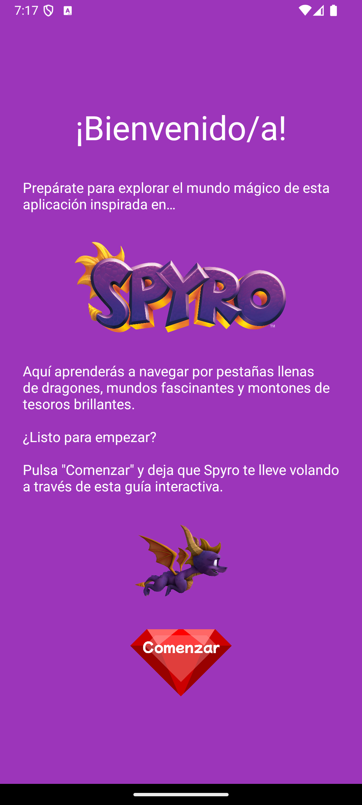
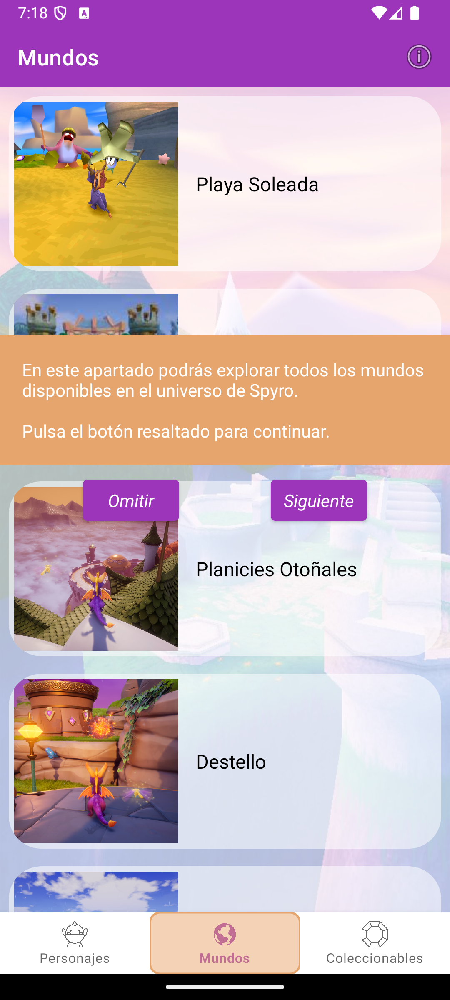
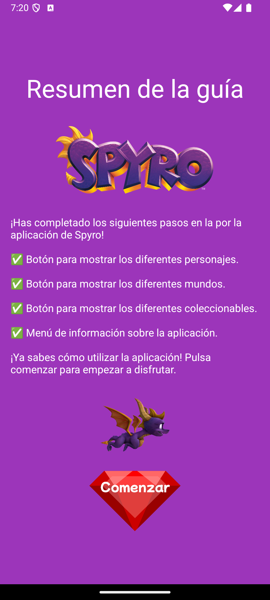
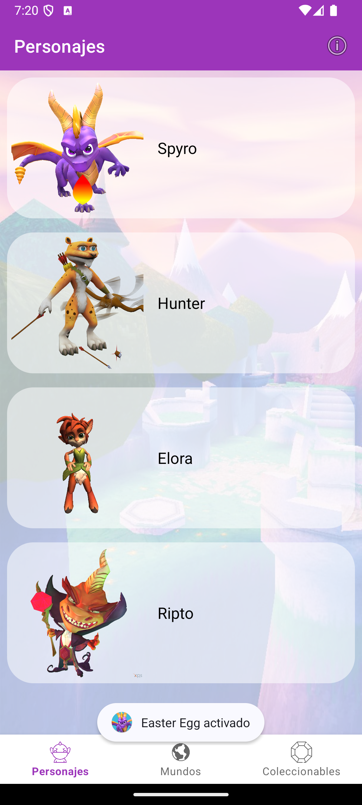
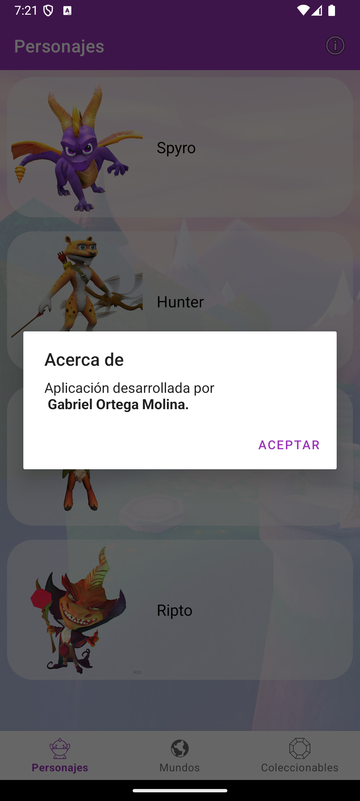

# Spyro The Dragon

## Introducción

**Spyro The Dragon** es una aplicación móvil diseñada para explorar el universo del famoso dragón Spyro, ofreciendo a los usuarios una experiencia interactiva y visualmente atractiva. La aplicación incluye una guía de inicio interactiva que presenta las principales funcionalidades de la app, así como dos Easter Eggs ocultos. El objetivo es mejorar la experiencia del usuario mediante el uso de animaciones, sonidos y elementos gráficos inspirados en el mundo de Spyro.

---

## Características principales

- **Guía de inicio interactiva:** Una guía paso a paso que introduce al usuario en las funcionalidades clave de la aplicación, utilizando animaciones y sonidos temáticos.
- **Easter Eggs:** Dos Easter Eggs ocultos... ¿Los podrás encontrar?.
- **Diseño temático:** Interfaz gráfica inspirada en el universo de Spyro the Dragon, con colores y elementos visuales que evocan el mundo mágico del juego.
- **Navegación intuitiva:** Una estructura de pestañas que permite a los usuarios explorar fácilmente los personajes, mundos y coleccionables de Spyro.
- **Animaciones y sonidos:** Efectos visuales y sonoros que enriquecen la experiencia del usuario y hacen que la aplicación sea más atractiva.

---

## Tecnologías utilizadas

- **Librerías y Frameworks:**
  - **Android Studio:** Entorno de desarrollo integrado para la creación de aplicaciones Android.
  - **XML:** Diseño de interfaces de usuario mediante layouts XML.
  - **Animaciones:** Uso de animaciones para mejorar la interactividad y el atractivo visual.
  - **Canvas:** Creación de animaciones personalizadas, como la llama de fuego de Spyro.
  - **SharedPreferences:** Almacenamiento local para controlar la visualización única de la guía de inicio.

- **Lenguaje:** Java.
- **Diseño:** Temas personalizados con colores y elementos gráficos inspirados en Spyro the Dragon.

---

# Instrucciones para ejecutar el proyecto

## Instrucciones de uso

### 1. Clonar el repositorio

En Android Studio, selecciona *Get from VCS* e introduce la dirección URL: `https://github.com/Patxito17/PMDM04.git`.

También se puede clonar el repositorio en tu máquina local ejecutando el siguiente comando en la terminal:
```bash
git clone https://github.com/Patxito17/PMDM04.git
cd PMDM03
```

### 2. Instalar dependencias

- Asegúrate de tener instalado Android Studio con el SDK de Android y Gradle configurado.
- Abre el proyecto en Android Studio y sincroniza las dependencias seleccionando la opción **"Sync Project with Gradle Files"** en la parte superior de la ventana.

### 3. Ejecutar la aplicación

- Conecta un dispositivo Android físico con modo de desarrollador habilitado, o configura un emulador Android.
- En Android Studio, selecciona el dispositivo desde el menú desplegable de dispositivos disponibles.
- Haz clic en el botón **"Run"** (o presiona `Shift + F10`) para compilar y ejecutar la aplicación.

### 4. Probar la aplicación

- Explora la guía de inicio interactiva para familiarizarte con las funcionalidades de la aplicación.
- Descubre los Easter Eggs ocultos en las pestañas de personajes y coleccionables.
- Navega por las diferentes secciones de la aplicación para explorar los personajes, mundos y coleccionables de Spyro.

---

## Notas adicionales

- Asegúrate de que el proyecto esté correctamente configurado en Android Studio para evitar errores de compilación.
- Si encuentras errores de dependencias, verifica que tengas las versiones compatibles de las bibliotecas mencionadas en el archivo `build.gradle`.
- Consulta la documentación oficial de Android si necesitas más ayudax.

---

## Conclusiones del desarrollador

El desarrollo de **Spyro The Dragon** ha sido una experiencia enriquecedora, permitiéndome explorar el uso de animaciones, sonidos y elementos gráficos para crear una aplicación dinámica y funcional. Este proyecto ha sido una buena oportunidad para trabajar el diseño de interfaces y la implementación de funcionalidades interactivas en aplicaciones Android.

## Capturas de pantalla

### Introducción a la Guía


### Muestra de una explicación en la Guía


### Resumen de la Guía


### Muestra de uno de los Easter Egg


### Diálogo "_Acerca de..._"

